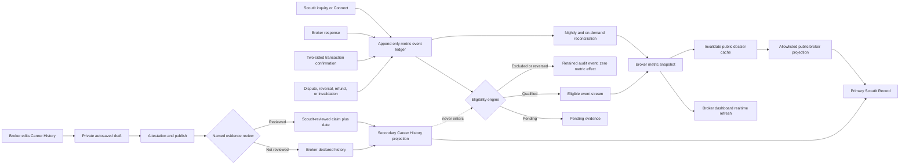

# A-023 — Canonical Broker Dossier and editor

> This file is A-023's single authoritative Active home. `ACTIVE.md` is its
> queue index.

## Outcome and current defect

Build one premium broker master page with two separate statistics templates,
authorized property representations, broker-written description, explainable
Scout Rating, client recommendations, inspectable ScoutIt contributions, and one
compliant Connect path. Editing uses the Property Review model: structured
editor left and exact desktop/mobile public preview right.

Today `/brokers/[broker-slug]` reads Airtable but its
`managedProperties` is always empty and it expects `broker.scoutRating`, which
normalization never supplies. `/profile/[id]` separately renders a 5-point
broker panel while the broker page expects 100 points. Identity, URL, and metric
authority must converge before expansion. The property-scoped roster also
claims its first broker is selected by an algorithm weighting subscription tier,
then calls the full roster “strictly” independently rated, “purely meritocratic,”
and untouched by commercial tier. No published formula or source supports those
claims; remove them in phase 1 rather than polishing contradictory trust copy.

## Locked authority

- ScoutIt owns composition, chapters, typography, motion, SEO, accessibility,
  metrics, trust labels, and Connect routing.
- Brokers edit declared facts only: portrait, biography, firm, markets,
  categories, languages, areas, working style, availability, and optional intro
  media.
- Brokers may edit Career History; they never edit credentials, represented properties,
  ScoutIt events/statistics, recommendations, contributions, or badges.
- Tier may change capacity/media limits; it never buys trust or rating.
- Every public card says whether it is broker-declared, client-submitted,
  ScoutIt-computed, staff-verified, or source-linked.

## Public dossier

1. **Identity + rating:** specific PRC evidence, markets, specialties,
   availability, and Scout Rating. Insufficient data says **Building a ScoutIt
   record**, never zero stars.
2. **Mathematical signals:** two isolated templates; the ScoutIt Record is primary.
   - **ScoutIt Record — primary:** automatically computed only from auditable
     activity completed through ScoutIt: qualifying two-sided transaction
     handshakes, in-platform response rate and median response time, qualifying
     recommendation count, transaction recency, and sample size. Brokers can
     inspect this record but cannot edit it.
   - **Career History — secondary:** broker-editable, self-reported experience
     such as years practicing, historical transaction count or volume, markets,
     property types, and date range. Every value requires a unit, coverage
     period, source/evidence note, and broker attestation. It remains labelled
     **Broker-declared** unless a named verification workflow has passed.
   - Never add, average, normalize, or visually merge Career History into the
     ScoutIt Record or Scout Rating. Low-sample, stale, disputed, or missing
     ScoutIt values stay absent rather than being backfilled from history.
3. **Current Representations:** compact cards derived only from active, visible,
   contactable, owner-accepted `property_broker_representations`. They link to
   canonical property pages without repeating chapters. Brokers cannot add,
   retain, or reorder them; ended/locked/suspended/withdrawn/off-market rows
   obey their visibility rules.
4. **About the Advisor:** structured broker-provided narrative with length,
   markup, unsupported-claim, and contact-leak controls.
5. **Client Recommendations:** ScoutIt cards with consented attribution,
   relationship type, date, moderation, and **Verified ScoutIt connection** only
   for a qualifying deal. External items remain unverified. Screenshots are
   private evidence, never public presentation.
6. **ScoutIt Contributions:** inspectable links to published Q&A, approved
   corrections, briefings, and credited Intel. Contributions stay separate from
   rating.
7. **Connect:** availability, service area, representations, Connect
   consequence, and compliant inquiry/viewing route; no public contact bypass.

## Rating and recommendations

- V1 Scout Rating follows the locked rule: only a completed two-sided
  buyer–broker transaction handshake qualifies; representation acceptance does
  not. Supporting statistics are named signals, not hidden weights.
- Remove conflicting 5-point and 100-point displays. Any future composite needs
  a published formula, anti-gaming review, minimum sample, reversal/dispute and
  backfill rules, plus separate owner approval.
- The ScoutIt Record always appears before Career History. Search/ranking,
  Scout Rating, ScoutIt badges, and platform incentives may use only eligible
  ScoutIt-owned events—not self-reported history, subscription tier, or paid
  visibility. Real platform use earns a richer sourced record, not an artificial
  score boost.
- Exclude circular, duplicate, self-dealing, test, collusive, rapidly reversed,
  or otherwise ineligible activity before aggregation.
- Reversed, disputed, duplicate, test, refunded, or invalidated events do not
  contribute; aggregates reproduce from audited source events.
- Recommendation authors choose full name, initials, role-only, or anonymous.
  Brokers cannot edit/fabricate them. Consent, source, proof, moderation,
  withdrawal, and redaction are recorded. No immature star average ships.

## Editor and data architecture

- Structured left editor, exact live preview, autosaved private draft, explicit
  publish state, dirty-state protection, completeness, and provenance.
- No custom font, palette, HTML, script, freeform layout, badge, property,
  ScoutIt metric, or recommendation controls; Career History uses fixed fields, units, periods, evidence, and attestation.
- Airtable `BROKERS_CMS` stays the public identity/content source; Supabase
  stays Auth plus private/operational authority. Broker drafts save to Supabase;
  an audited bridge publishes only allowed narrative fields to Airtable. Staff
  PRC/example/trust fields are excluded from broker payloads.
- Supabase owns representations, handshakes, recommendations, contributions,
  consent, disputes, ScoutIt aggregates, and versioned Career History claims. Public rendering consumes one allowlisted
  server projection, never private deal/message data.
- Link Auth UUID to BrokerID explicitly, never by mutable email/name.
- `/brokers/[BrokerID]` is canonical; broker-shaped `/profile/[id]` output
  redirects or becomes a non-indexed owner preview.

## Broker metrics update pipeline

The ScoutIt Record is event-driven and near-real-time; it is not recalculated
from every private deal whenever a profile opens. Career History follows a
separate broker-authored publishing path.

### Logical data boundaries

Names below are logical contracts; A-023's prepared migration will select final
table, view, function, and index names.

- **Metric event ledger:** append-only event ID, broker Auth UUID/BrokerID,
  event type, source entity, occurred-at time, eligibility state/reason,
  policy version, idempotency key, and reversal link. No client writes it
  directly.
- **Metric snapshot:** one reproducible aggregate per broker and metric window,
  including numerator, denominator, sample size, freshness, calculation time,
  and policy version. It contains no message body, client identity, negotiation,
  address, or private deal value.
- **Career History claims:** broker-owned draft and published revisions with
  fixed metric key, value, unit/currency, coverage dates, source/evidence note,
  attestation, verification state, reviewer, and withdrawal history.
- **Public projection:** allowlisted ScoutIt Record plus Career History under
  distinct keys. It cannot expose the event ledger or join private deal data.

### Update cadence and user experience

| Signal | Becomes visible | Delivery |
|---|---|---|
| Broker response time | After a valid response event | Dashboard within seconds; public cache invalidated |
| Response rate | After response or expiry closes an eligible inquiry | Snapshot refresh; show denominator/sample |
| Transaction | Pending after both sides submit; official only after eligibility passes | Pending privately, then qualified snapshot |
| Dispute/reversal | As soon as the authoritative state changes | Remove effect, retain audit/reversal link |
| Recommendation count | After qualifying connection, consent, and moderation | Snapshot refresh |
| Career History edit | Draft immediately; public only after attested publish | Separate secondary projection |
| Evidence review | After named staff workflow completes | Claim label and review date update |
| Reconciliation | Nightly, after policy changes, and operator-triggered | Rebuild snapshots and alert on drift |

The broker's authenticated editor may subscribe to their snapshot and draft
changes through Supabase Realtime. Anonymous public profiles use cache
invalidation/revalidation rather than permanent sockets; target freshness is
seconds to roughly one minute, while correctness and qualification take
priority over cosmetic instant updates.

### Calculation and integrity rules

- Completed ScoutIt transactions count distinct qualified two-sided transaction
  handshakes, never representations or unilateral clicks.
- Response rate is eligible inquiries answered within the published window
  divided by eligible inquiries whose window has closed.
- Median response time uses only eligible responses and always shows its window
  and sample; low samples are suppressed.
- Every write is idempotent. A retried webhook, route, or job cannot double-count.
- Qualification and snapshot refresh happen server-side, preferably in the same
  transaction or through a durable outbox; the browser never awards trust.
- Policy changes create a new calculation version and trigger reconciliation;
  they do not silently rewrite history without an audit trail.
- Failed aggregation leaves the last known snapshot marked stale and alerts
  operations. It never substitutes Career History or a fabricated zero.
- Public UI distinguishes **Pending**, **Building a ScoutIt record**,
  **Qualified**, **Stale**, **Disputed**, and **Unavailable** where applicable.

## Delivery phases

1. Converge live fields, canonical ID/URL, rating contract, and public-safe
   field tests.
2. Build the projection and dossier with loading, empty, stale, degraded, and
   error states.
3. Build ownership-checked draft/edit/publish, sanitization, autosave, preview,
   audit events, and honest empty composition.
4. Add versioned recommendation/contribution consent, moderation, withdrawal,
   dispute, private evidence, and artifact linkage.
5. Add reproducible metrics with sample/freshness thresholds and reversal
   handling.
6. Complete metadata, mobile/Lite/reduced-motion, migration/rollback, and owner
   visual review.

### Phase 1 checkpoint — 2026-08-26

The migration-free trust-convergence slice is implemented. The canonical
dossier and property roster no longer render the unsupported Airtable/legacy
five-point or 100-point composites, default missing performance to zero, rank
brokers by those values, or claim that subscription tier participates in a
trust recommendation. The roster preserves representation-authority order and
labels the absent metric projection **Building a ScoutIt record**. The public
roster API no longer emits the legacy rating/closure fields, private broker
profiles are excluded from its identity projection, and broker-shaped legacy
profiles are non-indexed.

A-023 remains Active: projection, generated representations, editor/publish,
recommendations, contributions, metrics, migrations, responsive verification,
and owner visual review are still open.

### Phase 2 checkpoint — 2026-08-26

The allowlisted public projection now exists and the dossier consumes it.

**The identity link was already there and nobody had used it.** Airtable's
`BrokerID` carries the broker's Supabase Auth UUID — verified against live data
(`e7f3634b-65d7-4adc-90ea-0544b61d988d` resolves to Marco Villanueva in both
systems). No migration was needed to generate representations. `BrokerID` is
therefore the link, resolved by UUID shape and never by name or email; when the
field is blank `fetchBrokers` falls back to an Airtable `rec…` id, which is not
an Auth identity and is treated as unlinked.

**Two defects closed:**

1. `managedProperties` was hardcoded `[]` in `src/lib/airtable.js`, so the
   dossier printed "No eligible public property representations are attached to
   this dossier." without ever consulting the representation authority. That is
   an assertion of absence produced by never asking (Rule 3, Rule 14). The
   section now reads `property_broker_representations` through the existing
   `isActiveRosterBroker`/`sortRoster` helpers and distinguishes four states:
   `LISTED`, `NONE_ELIGIBLE` (the only one that claims emptiness),
   `NOT_LINKED`, and `LOOKUP_FAILED`. State names are deliberately distinct from
   `REPRESENTATION_STATES`; an overlapping `UNAVAILABLE` in both would read as
   one condition and is two.
2. Phase 1 took the legacy composites off the screen but `/api/cms` kept
   shipping them. Live production was still publishing `rating: 92.5`,
   `closures: 34` and a commercial `subscriptionLabel` on every page load —
   public data regardless of whether a component read it (Rule 5). The broker
   payload is now allowlisted at source; the dead `TIER_LABEL_TO_NUM` map went
   with the field it fed.

A representation becomes a public card only when three independent sources
agree: the representation row is eligible, the Supabase property is live, and
the property is in the public Airtable catalog.

**Career History was deliberately not built.** Its claims table is
migration-gated under W-003, and the safest isolation from the ScoutIt Record
while no source exists is to publish no history at all. A contract test pins
that absence so a later phase cannot quietly merge the two templates.

**The loading state was not delivered in phase 2** (delivered in phase 3; the blocking report was a hidden-tab artifact — see below). A route-level
`loading.js` was built and then removed: with any `loading.js` present on
`/brokers/[broker-slug]`, the Suspense fallback stranded — `aria-busy="true"`
stayed visible with nine skeletons while the resolved dossier sat in a hidden
streaming div and was never swapped in. Removing the file restored correct
rendering; a minimal fallback with no `Header`/`Footer` reproduced the same
stall, so it is the boundary itself and not the fallback's content. SSR output
was correct in both cases. Root cause is unresolved and could not be tested
against a production server because `.next` was contended by another dev
process. Recorded in the Inbox as
`2026-08-26_ROUTE_LOADING_FALLBACK_STRANDS.md`.

Verified: 25/25 focused A-023 contracts (16 projection + 9 authority-read),
with the fail-closed guard mutation-tested — breaking the catch turns 3 tests
red, restoring it returns 9/9. Full gate green (3/3 surface locks, lint,
typography, 1,655/1,655 unit tests, 574 E2E cases discovered) and the production
build compiles. Browser-verified against a running server at 375px and 1280px:
zero horizontal overflow, one H1, grid collapses to a single column on mobile,
the notice variant renders its muted-gold rule, and no legacy composite appears
in the rendered text or the `/api/cms` payload.

Boundary: `NOT_LINKED` and `LOOKUP_FAILED` are unit-tested and style-verified
but not reachable with current data — all three live brokers carry a valid Auth
UUID, and `property_broker_representations` holds zero rows, so the live dossier
correctly renders `NONE_ELIGIBLE`. No deploy, migration, or live-data write.

### Phase 3 checkpoint — 2026-08-26

The ownership-checked draft/edit/publish lane is implemented, and
`/brokers/portal` — previously nothing but a redirect to `/dashboard` — is now
the editor's entry point.

**One composition, not two.** Rather than rebuild the public identity block
inside the editor, the existing markup was extracted verbatim into
`src/components/brokers/BrokerDossierIdentity.js` and rendered by both the
canonical dossier and the preview pane. "Exact preview" is therefore structural
rather than a promise maintained by hand: the two cannot drift because there is
only one component. The public page's classes and markup are unchanged.

**Two defects found by running the thing rather than reading it.** Both had the
same visible symptom — a permanently dead preview pane — and different causes:

1. `authorize()` computed the public identity and then every response threw it
   away. `GET` returned `{ record }` only, so the editor's
   `if (body.identity)` never fired and the preview could only ever say "Public
   identity preview is unavailable." Identity now travels with every response,
   including the 503 storage-unavailable path, because the preview must render
   even when nothing can be saved yet.
2. Ownership is checked through `resolveBrokerAuthorityId`, which lower-cases
   before matching, while the broker lookup beside it used a raw `===`. An
   uppercase Airtable `BrokerID` therefore passed the authority gate and matched
   no broker at all: authorized, and silently identity-less. The lookup now uses
   the same resolver as the gate. Not reachable with today's three
   lowercase-UUID brokers, which is exactly why it would have survived to
   whichever broker was first entered in uppercase.

**Three frontend-standard violations were corrected in the editor's styling**
before closing: `100vh` became `100dvh` (Part B; iOS Safari's toolbar makes `vh`
lie), inputs moved from 14px to 16px (below 16px iOS zooms the page on focus and
scrolls the preview — the one thing this screen exists for — out of view), and
the Save button lost its gold so Publish is the screen's single gold action.

**The publish path fails closed on fields it cannot honestly place.** Only
`biography` and `portraitUrl` have confirmed Airtable targets today, so
`getUnpublishableDraftFields` blocks publication with a 409 naming the offending
fields while the private draft is preserved. The remaining structured fields
autosave privately and wait for an owner-approved CMS schema rather than being
silently dropped or invented into a field that does not exist.

Publication order is pinned by contract: Airtable write → cache invalidation →
publish marker. A marker failure after a successful Airtable write reports
pending confirmation and stays safely retryable rather than claiming success.
`invalidateCmsBundle` waits for any in-flight rebuild before clearing both cache
layers, so a rebuild started before the publish cannot repopulate stale content
after it.

**The loading state is now delivered, and the thing that blocked it was not
real.** Phase 2 skipped it on the strength of an Inbox report that a route-level
`loading.js` stranded its Suspense fallback. Re-run against a production
`next start` build on an uncontended build directory, the stall reproduced —
and then reproduced just as cleanly on a throwaway route with no Header, no
Footer, no CSS import and a 300 ms await, which ruled out every
dossier-specific explanation.

The cause is in React's own emitted runtime. `$RC` pushes a completed boundary
into `$RB` and schedules the reveal with **`requestAnimationFrame`**, and a
browser does not fire rAF in a tab whose `visibilityState` is `hidden`. The
automation pane runs hidden, so `$RV` never ran, `$RT` stayed `undefined`, and
`$RB` held `[TEMPLATE#B:0, DIV#S:0]` forever. Calling `window.$RV(window.$RB)`
by hand — exactly what rAF would have called — swapped both the probe route and
the real dossier correctly and instantly. No user with a visible tab is
affected. The earlier "a hidden container with no completion call" evidence was
also a miscount: that container is resumed by `$RS`, not `$RC`.

The shipped skeleton reuses the dossier's own layout classes rather than
inventing geometry, so the fallback occupies the identical grid: measured
`320px 800px` at 1180px wide desktop and a single `285px` column at 375px,
matching the resolved dossier exactly in both, with zero horizontal overflow.
It makes no claim about the broker — blank bars only, no rating, count, or
name — carries one polite `role="status"` line with everything decorative
`aria-hidden`, and its 1.4s sweep animates only `background-position` and is
disabled entirely under `prefers-reduced-motion`. Four contract tests pin the
shared-class reuse, the skeleton-not-spinner rule, the no-claims rule, and the
reduced-motion/channel-syntax rules.

Verified: 39/39 focused A-023 contracts (32 existing, 3 new identity cases, 4 loading-state cases),
with all three identity tests watched red before the fix and green after. The
phase-1 trust contract asserted "Building a ScoutIt record" against `page.js`;
the extraction moved that markup, so the assertion was re-aimed at the shared
component in the same change rather than deleted (Rule 14), and now pins the
absence of legacy composites in *both* files. Full gate green: 3/3 surface
locks, lint, typography across 491 files, 1,682/1,682 unit tests, 574 E2E cases
discovered. Browser-verified against a running server at 375px and 1280px: the
public dossier is unchanged by the extraction (one H1, `320px 800px` desktop
grid collapsing to one column at 375px, zero horizontal overflow, no legacy
composite in rendered text), and `/brokers/portal` renders noindex with ten
structured fields, a smallest input font of 16px, zero overflow, and an honest
signed-out state: an explanatory message, disabled fields, and disabled actions.
All three API methods return 401 unauthenticated under `private, no-store`.

Boundary: **the authenticated editor path is not browser-verified.** It requires
a real broker Supabase session, and `broker_dossier_drafts` does not exist until
W-003 is applied, so today every authenticated load would return the
`schema_unavailable` 503 the editor renders as its migration notice. Draft save,
autosave, conflict (409), and publish are covered by unit tests and the prepared
RPC only. Career History remains unbuilt and contract-pinned absent. The
phase-2 route-level `loading.js` stall is closed as a test-harness artifact, and
both open A-023 Inbox notes are resolved: the `.sr-only` report was a false
positive (it is a Tailwind-generated utility, verified 1x1 and hidden in a
browser; the original grep searched only `*.css`, where a generated utility can
never appear). No commit, push, deploy, migration, or live-data write.

### Phase 4 checkpoint — 2026-08-27

Client Recommendations and ScoutIt Contributions are implemented as two
independent authorities, each with its own pure projection, its own fail-closed
server reader, and its own four-state section. Both are read in parallel and
neither can block the dossier or each other.

**Attribution is the privacy boundary, and it is written to fail closed.**
`publicRecommendationAuthor` resolves `full_name`, `initials`, `role_only` and
`anonymous` with `=== known good` checks; an unrecognised mode resolves to
**Anonymous client**, never to the name (Rule 6). The guard was mutation-tested:
rewriting it as the negative form `mode !== ANONYMOUS` — the exact shape Rule 6
warns about — turns three tests red because the real surname leaks in three
modes; restoring it returns 19/19.

**"Verified ScoutIt connection" is earned only by a qualifying two-sided
handshake.** Without one the card reads **Client-submitted · unverified**
rather than going unlabelled, so an unverified recommendation states its own
status instead of borrowing credibility from the verified ones beside it. The
verified chip reuses the green treatment the PRC badge already established
(`#4caf7d`), deliberately not gold: verification is a status, and the dossier's
one gold action is Connect.

**A contribution that cannot be opened is not published.** A-023 requires
contributions to be inspectable, so `resolveContributionHref` admits only a
site-internal absolute path; a scheme, a protocol-relative `//host`, a
backslash variant, or any whitespace/control character drops the card rather
than being normalised into an `href` on a public page. The same rule is
enforced again in the migration's `CHECK` so an unsafe path cannot be stored.
Contributions carry no score, weight or rank, and a test asserts that absence.

**Private evidence is protected by not being selected.** `evidence_url` and the
submitting client's identity are absent from the public reader's column list
entirely, which is a stronger guarantee than selecting them and remembering to
strip them downstream. The prepared migration enables RLS with **no policy** on
all three tables and revokes the default grant, so consent records and
moderation evidence are unreachable from a browser (Rules 5 and 8). Schema
defaults cannot manufacture a claim: `consent_granted` and `attribution_mode`
are NOT NULL with no default, `moderation_state` defaults to `pending` and
`status` to `draft` — the states that publish nothing (Rule 7). Self-dealing
and duplicate recommendations are excluded by constraint and unique index.

Verified: 37/37 focused phase-4 tests (19 recommendation, 11 contribution,
7 wiring/migration contracts) plus the mutation proof above. Full gate green
and the production build compiles.

Browser-verified against a production `next start` build at 375px and 1280px.
**Both sections' `LOOKUP_FAILED` state was verified against genuinely absent
tables** — the fail-closed path is real, not simulated: the dossier says the
data "could not be loaded just now… not a statement that none exist" and never
claims the broker has none. The `LISTED` state was then verified with a
temporary in-process fixture, removed immediately afterwards, which proved the
end-to-end privacy behaviour in the rendered HTML: the full-name author and
both source labels appear, while the **anonymous author's real surname, the
pending-moderation row, and the off-site contribution are all absent from the
page**. Layout measured: verified chip `rgb(76, 175, 125)`, contribution rows
53px tall against the 44px minimum, internal hrefs only, 16px quote body, one
H1 with both new sections as H2, zero horizontal overflow, and no gold
introduced by either section.

Boundary: `broker_recommendations`, `broker_contributions` and their audit
table do not exist until W-003 is applied, so today every live dossier renders
the read-failure state for both sections. Submission, consent-capture, and
moderation *interfaces* are not built — this phase delivers the authority
contract, the public projection, and the prepared schema. No commit, push,
deploy, migration, or live-data write.

### Phase 5 checkpoint — 2026-08-27

The ScoutIt Record is live and computed. **W-003 was cleared by the owner on
2026-08-27 and all prepared migrations are applied to the live ScoutIT project**
(`yyixsuaimdzyiocswcgc`), so phases 3, 4 and 5 are now verifiable against real
data rather than against fixtures.

**Checking the database first changed the design.** Before writing anything,
the live tables were read: `deal_handshakes` 0 rows, `deals` 0, `deal_messages`
0, `deal_disputes` 0, `property_broker_representations` 0. Every input to the
Scout Rating is empty, so a full event-ledger pipeline would have computed
"Building a ScoutIt record" for every broker — the exact string already on the
page (Rule 13, Rule 21).

**No separate event ledger was built.** `deal_handshakes`, `deals`,
`deal_messages` and `deal_disputes` already are the audited event sources.
Duplicating them into a parallel ledger would create two versions of the truth
and a reconciliation problem that need not exist (Rule 2). A snapshot is a
cached aggregate, always reproducible by re-running
`recompute_broker_metric_snapshot` against those tables.

The qualification rules are enforced in SQL as positive checks:
`transaction_handshake` only — representation acceptance never counts —
`status = 'completed'`, both parties signed, `party_a_id <> party_b_id` to
exclude self-dealing, `count(DISTINCT deal_id)` so a retried handshake cannot
double-count, and exclusion of any deal carrying a dispute that is not
`dismissed`. The function is `SECURITY DEFINER` with `SET search_path = ''`,
revoked from PUBLIC/anon/authenticated and granted only to `service_role`
(Rule 8). The table is RLS-enabled with zero policies.

**Every exclusion was proven behaviourally, not asserted.** The function's exact
predicates were run against synthetic rows covering each rejection path, with no
write to any live table:

| Case | Counts |
|---|---|
| valid completed transaction handshake | yes |
| representation handshake | no |
| status not `completed` | no |
| only one party signed | no |
| self-dealing (`party_a = party_b`) | no |
| deal under a live dispute | no |
| deal whose dispute was `dismissed` | yes |

Idempotency was proven the same way: three qualifying rows containing one
retried `deal_id` yield a naive count of 3 and a `count(DISTINCT deal_id)` of 2,
so a replayed handshake cannot inflate the record.

**Suppression is the feature.** `MIN_RESPONSE_SAMPLE` is 5. Below it a metric
returns `LOW_SAMPLE` with a null value rather than a rounded figure, and every
published number carries its own sample so it can be sourced (Rule 3). The
guard was mutation-tested: disabling it publishes "33%" from a three-inquiry
sample and turns the suppression test red.

**Demo data, and the safety properties that make it honest.** The owner asked
for mock data so the surface works before real deals exist. All three live
brokers are `is_example_account = true` invented personas, so seeding them is
the repo's established example-account pattern rather than a fabricated claim
about a real person. Three structural guarantees:

1. The seed INSERT is driven by a SELECT over `user_profiles` filtered on
   `is_example_account IS TRUE`. There is no broker id literal to mistype, so a
   real broker cannot be seeded even by accident.
2. Every seeded row carries `source = 'example_seed'`, self-declaring in the
   database rather than indistinguishable from computed data.
3. `recompute_broker_metric_snapshot` returns an `example_seed` row untouched,
   so a later recompute can neither zero the demo nor relabel it as computed.
   Verified live: after recompute the row still reads `example_seed`, 6.

Live check confirms **0 real accounts hold a snapshot** while 3 real accounts
exist.

**One precondition had to be fixed before seeding.** The directory has always
flagged example profiles, but the canonical dossier never did — `isExample` was
projected and never rendered — so a visitor arriving directly at
`/brokers/[id]` saw no notice. Demo figures on an unlabelled page would be
unsourced claims, so the dossier now carries **"Example profile · illustrative
data, not a real advisor record"**.

The three personas were deliberately seeded into different states so every
branch is exercised by real data, and all three were verified in a browser
against a production build reading the live database:

| Broker | State | Rendered |
|---|---|---|
| Marco Villanueva | Qualified | 6 (n=6), 89% (n=19), 38 min (n=19) |
| Isabella Reyes | Mixed | 1 transaction (n=1); **both response metrics "Too few to publish yet"** at sample 3 |
| Daniel Ocampo | Building | "Building a ScoutIt record" from the genuine no-snapshot path |

Isabella is the important row: the system refuses to publish 67% and 1.6 hrs
from a three-inquiry sample on a live page.

The editor preview consumes the same record through the dossier API, so the
preview and the public page cannot disagree about the record either.

Verified: 22/22 focused phase-5 tests (10 projection incl. the mutation proof,
12 SQL/seed/UI contracts), production build compiles, live SQL guards
re-verified. Measured in-browser: one H1, zero gold introduced in `main`, zero
horizontal overflow at 375px and 1280px, 12px typography floor respected.

Boundary: response-rate and median-response inputs (`deals`, `deal_messages`)
remain empty in production, so those two metrics are exercised only through the
example seeds; the first real deal will produce the first computed row. There
is no scheduled recompute job yet — the function exists and is service-role
callable, but nothing calls it on a timer, so a real broker's snapshot is
created on first recompute rather than automatically. Career History remains
unbuilt and contract-pinned absent.

### Phase 6 checkpoint — 2026-08-27

Metadata, structured data, robots policy, responsive/Lite/reduced-motion
verification, and the rollback path are complete.

**Structured data withholds two claims on purpose.** The site-wide schema
asserted `RealEstateAgent` until 2026-08-08 and contradicted `/terms`, which
states ScoutIt is strictly not a real estate broker under RA 9646. A broker may
genuinely hold that type — but only once staff have verified the PRC licence,
so an unverified broker is described as `Person` and their licence number is
not published at all. Second, `aggregateRating` is never emitted: Google renders
it as stars, and A-023 forbids shipping a star average, so emitting one would
put stars in search results that the page itself refuses to show. Client
recommendations likewise produce no `Review` objects.

**Example profiles are non-indexable and carry no structured data.** All three
live brokers are example accounts, so `/brokers/*` currently returns
`noindex, follow` with zero broker JSON-LD — verified in the served HTML. A
machine-readable claim about an invented advisor is worse than no claim.
`/brokers/` is not in `robots.js`'s disallow list, so this directive is
load-bearing rather than redundant.

**One divergence class was closed.** `generateMetadata` and the page body each
carried their own `find(b => b.id === slug)`. Two independent lookups can
disagree — that is how a page renders one advisor and titles itself another.
Both now call one `findPublicBroker`, which also matches Auth UUIDs
case-insensitively so a lower-cased URL resolves instead of 404ing.

Also delivered: OpenGraph (`type: profile`) and Twitter card metadata with the
canonical URL, and a rollback at
`supabase/rollback-proposals/20260827000001_a023_broker_dossier_rollback.sql`.
It was first written into `supabase/migrations/`, and the repository's own test
suite rejected it: an existing contract requires that directory to hold forward
versions only, because a rollback sitting there is one `supabase db push` away
from dropping production tables. The guard was right and the file moved to the
established `rollback-proposals/` home rather than the guard being relaxed.
Its drop order was verified against the live FK graph rather than
assumed: `broker_social_proof_audit_events` is the only table with A-023-internal
references (to both recommendations and contributions, `ON DELETE RESTRICT`), so
it drops first. Step 1 is a reversible seed-only delete, dry-checked live as
matching exactly the 2 example seeds and preserving any computed row.

Verified: 10/10 schema tests, full gate, production build. In-browser against a
production server on live data: `noindex, follow`, zero broker JSON-LD,
`og:type=profile`, canonical correct, one H1, zero overflow, and all four
reduced-motion rules confirmed present in the loaded stylesheets. Lite Mode's
global `html.lite-mode *` `!important` rules cover every animation added by this
workstream.

## A-023 line audit — 2026-08-27

A full pass over the locked A-023 requirements against shipped code. Two gaps
were found and fixed in this phase; the rest are recorded honestly rather than
quietly carried.

**Fixed during the audit:**

- **The biography had no provenance label.** A-023 requires every public card to
  say whether it is broker-declared, client-submitted, ScoutIt-computed,
  staff-verified, or source-linked. The narrative is broker-written and sat
  unlabelled beside ScoutIt-computed panels, borrowing their authority. It is
  now headed **About the Advisor** with a **Broker-declared** marker.
- **The editor offered eight fields that can never publish.** Airtable
  `BROKERS_CMS` supplies only name, title, specialty, location, bio and image;
  there is no column for firm, markets, categories, languages, service areas,
  working style, availability, or intro media. A broker could fill all ten in
  and be refused at publish. The editor now separates **"Publishes to your
  public dossier"** (portrait, biography) from **"Saved privately · no public
  home yet"** with the reason stated inline.

**Open gaps, in priority order:**

| # | Gap | Status |
|---|---|---|
| G1 | No recommendation submission or moderation interface | **CLOSED 2026-08-27** — see below |
| G2 | No contributions producer | **CLOSED 2026-08-27** — staff-only editorial route; see below |
| G3 | Nothing calls `recompute_broker_metric_snapshot` | **CLOSED 2026-08-27** — see below |
| G4 | Career History (the secondary template) unbuilt | **CLOSED 2026-08-27** — built with schema-enforced attestation; see below |
| G5 | Eight broker-declared fields have no public home | Open, owner-gated. Needs Airtable `BROKERS_CMS` columns; now honestly labelled in the editor |
| G6 | No single Scout Rating composite | Open by design. A composite needs a published formula, anti-gaming review and separate owner approval |

**G3 closed — the recompute now has a caller.** `/api/cron/recompute-broker-metrics`
runs daily at 03:00 UTC behind `authorizeCronRequest`, sweeping every
non-archived broker. It fails closed with no `CRON_SECRET` (503) and on a wrong
token (401), both proven to reject *before* any database call. One broker's
failure does not abandon the roster, and the response reports `recomputed` and
`failed` separately so a partial sweep is never reported as a clean one.

The repo's own cron guard was strengthened in the same change: it previously
asserted two hardcoded paths, so a route could exist on disk and be registered
nowhere — exactly the defect that produced G3. It now enumerates
`src/app/api/cron/` from disk and requires each route to be registered or named
in an explicit allowlist. `osint-scraper` is the one allowlisted exception
(disarmed 2026-08-06 for fabricating PSE disclosures) and its reason is stated
inline. The new assertion was mutation-tested: unregistering the cron turns it
red naming the exact route.

**G1 closed — recommendations can now be produced, moderated and withdrawn.**
Three values are decided server-side and can never be supplied by a client:
the author (from the session), the verified-connection status (looked up in
`deal_handshakes`), and the moderation state (always `pending` on insert).
The submission validator rejects `qualifyingHandshakeId` and `moderationState`
as unknown keys outright rather than stripping them, so an attempt to
self-verify or self-publish is answered rather than silently ignored.

Consent must arrive as an explicit boolean `true` — not `"true"`, not `1`, not
absent-and-assumed — and is stored with its timestamp. A submitter must already
hold a deal with the broker; without that gate any account could write about any
broker, which is a defamation surface rather than a recommendation system.
Self-recommendation is refused, submissions are rate-limited to 5/hour, and the
global write freeze is honoured.

Moderation (`PATCH`, staff-only via `requireAdmin`) and withdrawal (`DELETE`,
author-only) are deliberately separate verbs rather than one endpoint with a
role switch. Withdrawal sets `withdrawn_at` and retains the row: destroying it
would destroy the evidence that consent was given and then revoked, which is
the one record that cannot be reconstructed. A withdrawn recommendation cannot
be approved back into publication — the moderation update is scoped
`.is("withdrawn_at", null)`, so a moderator does not outrank a revoked consent.

Verified: 20 submission-boundary tests, 7 route contracts, 6 moderation
contracts, 6 cron tests, plus the strengthened cron-registration guard.

**Every new endpoint was run, not just built** (Rule 15). Against a production
server: `POST /api/broker/recommendations`, `PATCH` and `DELETE` on
`/api/broker/recommendations/[id]`, and the cron with no token and with a wrong
token all return 401 — five fail-closed paths confirmed live. The cron's
authorized path was then exercised against the real database and returned
`{"ok":true,"scanned":3,"recomputed":3,"failed":0}`.

**The seed guard held under a real sweep**, which is the check that mattered:
after the cron recomputed all three brokers, Marco and Isabella were still
`example_seed` with their values intact, while Daniel — who had no snapshot —
gained a genuine `computed` row of honest zeros. A real sweep neither wiped the
demo nor relabelled it.

**Running the cron surfaced a live configuration defect.** The first
`CRON_SECRET` in `.env.local` returned 401 and the second returned 200: the file
defines the key twice with two different values. That reproduces the
unverified 2026-08-22 Inbox note on a second, unrelated route, which removes its
caveat — it is the shared secret, not one job. Four scheduled jobs now depend on
it, and if Vercel holds the dead value all four return 401 nightly and silently
do nothing. Promoted to owner action **O-012**; reading or rotating a deployment
secret is not an agent's call.

**G4 closed — Career History ships as a genuinely separate template.** A-023's
hardest rule is that the two statistics templates never add, average, normalize
or visually merge, so the isolation is structural at every layer rather than a
convention:

- **Storage:** `broker_career_claims` is its own table with no join and no
  shared function with `broker_metric_snapshots`.
- **Projection:** `brokerCareerHistory.js` imports nothing from
  `brokerMetrics.js` and takes no snapshot argument; there is no parameter
  through which one could influence the other. A contract test asserts the
  absence of any cross-reference in both directions.
- **UI:** the ScoutIt Record renders in the identity block, always before the
  Career History section, and a test pins that ordering by source position.
  A declared figure is set at 20px body weight against the record's 26px
  display type, so the emphasis differs as well as the position.

Every claim requires a unit, both coverage dates, a source note and an explicit
boolean attestation. Publication without attestation, a review without a named
reviewer, a backwards coverage period, and a claim with no value at all are all
**rejected by the database**, proven live inside a transaction that was rolled
back — the table still holds zero rows. `verification_state` defaults to
`broker_declared` and is refused as an unknown key if a broker sends it:
attestation is the broker saying so, review is ScoutIt saying so, and only the
second changes the public label.

**The phase-2 guard caught this build, which is what it was for.** Phase 2
pinned Career History's deliberate *absence* so a later phase could not quietly
merge the two templates, and that assertion went red the moment G4 created the
surface. It was re-aimed rather than deleted (Rule 14): it now asserts the
isolation it was always protecting — no career reference in the identity
projection, no cross-import between the two projections in either direction,
and the record rendered before the history from separate lookups. The re-aimed
guard was then mutation-tested by adding a `careerHistory` parameter to
`buildScoutItRecord` — exactly the merge A-023 forbids — which turns two tests
red across two files, and green again on restore.

**G2 closed — contributions can now be credited.** `/api/broker/contributions`
is **staff-only** by design, and that is the substance rather than a
convenience: a contribution is ScoutIt crediting a broker for work ScoutIt
published, so a broker-facing form would let a self-declared claim wear a
platform-credited label. The artifact path is validated with
`resolveContributionHref` — the public projection's own resolver — so a row that
would be silently dropped at render time is refused at write time instead.
Retraction sets `status = 'retracted'` rather than deleting, and both verbs are
audited.

**Verified clean:** no public contact bypass (no `mailto:`/`tel:` on the dossier
or Connect path), and no deal, message, buyer, private-note or pitch data
reachable from any broker projection.

## Final verification — 2026-08-27

Run fresh at the close of the workstream, not carried forward from an earlier
message.

- **Full gate `GATE=0`:** 3/3 approved-surface locks, ESLint clean, typography
  clean across 499 source files, **1,831/1,831 unit tests across 184 files**,
  574 E2E cases discovered. Production build compiled.
- **Live database:** all seven A-023 tables RLS-enabled with **zero policies**,
  revoked from anon/authenticated, service-role only — asserted against
  `pg_class`/`pg_policies`, not the migration text (Rule 20).
- **Seed safety:** 2 example seeds, 1 computed row, and **0 real accounts
  holding seeded data**.
- **Isolation proven on a live page:** Marco's dossier shows 6 completed ScoutIt
  transactions in the primary record and 180 declared career transactions in
  the secondary section. They are never summed — neither 186 nor 195 appears
  anywhere in the rendered text. Record values render at 26px display type,
  career values at 20px body weight, and the record sits above the history in
  document order.
- **Responsive:** one H1, zero horizontal overflow at 375px and desktop, 12px
  typography floor respected, career grid collapsing to a single 285px column.
- **Clean tree:** no fixture, probe, `distDir` hook, TODO, or `console.log`
  left in any A-023 file; the rollback lives in `rollback-proposals/`, every
  file in `migrations/` carries a 14-digit prefix, and all verification servers
  are stopped.

### Requirement coverage

| A-023 public dossier requirement | State |
|---|---|
| 1. Identity + rating, never zero stars | Shipped |
| 2a. ScoutIt Record — primary, computed | Shipped |
| 2b. Career History — secondary, declared | Shipped |
| 3. Current Representations | Shipped |
| 4. About the Advisor + provenance label | Shipped |
| 5. Client Recommendations | Shipped, with producer |
| 6. ScoutIt Contributions | Shipped, with producer |
| 7. Connect, no public contact bypass | Shipped; zero `mailto:`/`tel:` |

Twenty-seven A-023 test files cover the workstream.

### What remains, and why it is not engineering

- **G5 — eight broker-declared fields have no public home.** Airtable
  `BROKERS_CMS` carries only name, title, specialty, location, bio and image.
  Publishing the rest from Supabase instead would contradict A-023's locked
  architecture ("Airtable stays the public identity/content source"), so it is
  an owner decision rather than a change to make unilaterally. The editor
  already separates the two publishable fields from the eight that only
  autosave, and states why inline.
- **G6 — no single Scout Rating composite.** Correct by design: A-023 requires
  a published formula, anti-gaming review, minimum sample, and reversal/dispute
  rules with separate owner approval before any composite ships.
- **O-012 — duplicate `CRON_SECRET`.** Owner-gated; four scheduled jobs depend
  on the outcome.

## RA 9646 compliance audit — 2026-08-27

The dossier serves Philippine real estate practice, so it was re-checked
against the Real Estate Service Act (RA 9646) and DHSUD/PD 957 rather than
against general assumptions about "brokers". Sources are listed at the end.

### The rules that actually bind

- A **real estate broker** passes a PRC licensure examination and is licensed.
  The licence is valid for **three years** and renews on CPD units (45 units
  per cycle).
- A **real estate salesperson** is **accredited, not licensed**. They must work
  under the direct supervision of a licensed broker, **independent selling is
  illegal**, the accreditation card renews every **two years**, and there must
  be at least one licensed broker for every twenty accredited salespersons.
- **DHSUD registration** (PD 957) is separately required to sell subdivision
  and condominium projects, and its certificate renews **annually**.

### Finding 1 — FIXED: the PRC badge ignored expiry

`licenseVerified` came from a single Airtable `License_Verified` checkbox that
staff tick once. Nothing anywhere in the public projection consulted an expiry
date, although `user_profiles.prc_expiry` exists in Supabase and the dashboard
already collects it. A licence that lapsed in 2024 would therefore have
rendered **"✓ PRC VERIFIED · <number>"** indefinitely — and, after phase 6,
would also have emitted `"@type": "RealEstateAgent"` with a `hasCredential`
block into structured data. Asserting a current professional licence for
someone whose registration has expired is a licensing claim, and it is the same
class of error the site-wide schema already made and corrected in August.

`brokerCredential.js` now resolves three outcomes, and only the first may back
a licensed-profession claim:

| State | Public label | Licensed claim |
|---|---|---|
| Verified and unexpired | `PRC VERIFIED · <no>` + "Valid to <date>" | Yes |
| Verified, expiry passed | `PRC registration lapsed · expired <date>` | No — number withheld |
| Verified, no expiry recorded | `PRC checked <date> · renewal date not recorded` | No |

Verification state is read from Supabase, which respects the dual-CMS rule:
Airtable remains the public identity/content source, Supabase remains the
operational authority, and whether a licence is current is operational truth.
A NULL expiry is treated as unknown, never as valid (Rule 14), and the gate is
written as "current only when every condition is affirmatively true" (Rule 6).
The lapsed state is *stated* rather than rendered blank, because silence would
read as "no licence" instead of "registration needs renewing".

**This defect was latent, not live.** Live check: zero users have a recorded
`prc_expiry` and `prc_verified` is false for all three brokers, so no PRC badge
is currently rendered on any dossier. The fix prevents the defect from
activating the first time staff verify somebody — which is exactly when nobody
would be looking for it.

### Finding 2 — OPEN, owner decision: no salesperson role exists

Live roles are `admin`, `broker`, `provider`. There is no concept of a real
estate **salesperson**, yet under RA 9646 that is a materially different status:
accredited rather than licensed, valid only under a named supervising broker,
renewed every two years, and capped at twenty per broker. A salesperson signing
up today would be carried as a "broker" and presented on a dossier headed
**Advisory Profile** with a PRC licence field.

This is not a code fix. It changes the role taxonomy, onboarding, the directory's
semantics, and the supervising-broker relationship, so it needs a product
decision. Recorded as owner action **O-013**.

### Finding 3 — OPEN, correctly withheld: DHSUD registration

`user_profiles.dhsud_number` is collected in the broker dashboard and is **not**
published on the dossier, which is the right call today: DHSUD certificates
renew annually and there is no expiry column for them, so publishing the number
would assert a currency nothing can verify — the same defect as Finding 1 in a
different field. The reader fetches it and deliberately does not surface it.

It becomes material because ScoutIt does list residential inventory (3 of 13
live properties), and PD 957 governs subdivision and condominium sales.
Displaying it needs an expiry column and a renewal policy first. Folded into
**O-013**.

### Verified clean against RA 9646

- ScoutIt itself is typed `Organization`, never `RealEstateAgent`, matching
  `/terms`' statement that ScoutIt is not a broker under RA 9646.
- No public contact bypass on the dossier or Connect path, so ScoutIt does not
  route a transaction around a licensed practitioner.
- No commission, fee, or brokerage-service claim appears anywhere in the
  dossier projections.

**Sources:** PRC Professional Regulatory Board of Real Estate Service
Resolution No. 11; DHSUD broker/agent registration guidelines; RESA (RA 9646)
practitioner summaries. Links are recorded in the session log.

## Boundary and exit test

Code and prepared migrations are Active; live application remains behind
[[WAITING#W-003|W-003]]. Never fabricate/backfill scores, reviews, response
times, closures, contributions, or properties; never expose client identity,
messages, deal value, negotiations, private saves, or withdrawn properties.

Done means one canonical URL serves every entry path; brokers publish only
allowed narrative; preview matches public output; representations match eligible
authority; V1 rating matches qualifying handshakes including reversal,
duplicate, and test cases; every recommendation has consent/source; every
contribution opens its artifact; low-sample/error states make no false claim;
authorization, privacy, XSS/contact-leak, accessibility, metadata, responsive,
full verification, build, and 3/3 surface locks pass. Live schema/data/deploy
changes remain separately owner-approved.

The two templates must remain mathematically isolated in storage, projection,
UI, ranking, and rating tests. Historical edits must never alter the primary
ScoutIt Record.

---

## Successor work — 2026-08-27

A-023's six delivery phases are complete. Three follow-on tasks now carry what
this plan opened but did not close. They are recorded here so this document
stays the canonical broker-dossier map rather than a snapshot of one week.

### Correction: W-003 is cleared

The Boundary section above still reads "prepared migrations are Active; live
application remains behind W-003." **That is no longer true.** The owner cleared
W-003 on 2026-08-27 and every prepared A-023 migration is applied to the live
ScoutIT project. Six tables and three functions exist, all RLS-enabled with zero
policies, revoked from anon/authenticated and granted only to `service_role`;
every `SECURITY DEFINER` function is `search_path`-pinned. Verified against
`information_schema` rather than the migration text (Rule 20). Treat the older
sentence as history.

### A-037 — the ScoutIt Record is now read at a glance (closed)

The three computed figures are encoded in a compact card beside the advisor's
identity, on the canonical dossier and in the editor preview that shares the
identity block. The detail panel no longer repeats the numbers; it keeps
provenance and the BUILDING/UNAVAILABLE explanations.

The governing constraint is worth preserving, because it will recur every time
someone proposes "one chart for the broker stats": **the three metrics carry
incompatible units.** A count, a percentage and a duration share no axis, and
drawing them against one would present them as comparable magnitudes. So:
transactions get one tick per transaction (a count has no natural maximum);
response rate gets the only honest meter (a true ratio against 100); and the
median reply gets a figure with no bar at all, because its only defensible
denominator is the 24-hour eligibility window, in which 26 minutes renders as an
unreadable sliver. Inventing a friendlier ceiling would publish a benchmark
ScoutIt never set (Rule 12).

Suppression is enforced in the encoding, not only in the copy: a metric below
the publication floor returns no fill and no ticks, so an unpublishable figure
can never appear as a bar.

### A-038 — the producer for G1 and G2 (Active, not started)

G1 and G2 were recorded as producer/consumer gaps. Re-checked on 2026-08-27 and
the finding is sharper than first written: both routes exist, are
authorization-correct and are tested, and **a search for callers returns only
their own test files**. Every recommendation currently visible on a dossier was
written directly into Supabase. Recommendations cannot appear on their own
however many deals complete.

A-038 adds the missing producer on owner direction: after a completed two-sided
handshake, the counterparty is offered a place to describe how the broker
performed, routed through staff approval.

**It introduces no rating, and that is deliberate.** This plan retired the legacy
rating composites in phase 1, withholds `aggregateRating` from structured data,
and leaves the single Scout Rating composite (G6) unbuilt pending a published
formula, anti-gaming review and separate owner approval. A-038 captures written
feedback with consented attribution only. A visible score remains G6's decision;
building one inside A-038 would reinstate through the back door what phase 1
removed from the front.

### A-039 — the left panel is now an orphan (Active, not started)

Moving the figures out left a full-size bordered box carrying one line of small
print, and `SCOUTIT RECORD` now appears twice in the page. The sentence is
load-bearing — it is the provenance declaration this plan requires of every
public card, and the state copy for records with no chart — so where it should
live is a composition decision for the owner rather than a cleanup.

### Live demo state

Marco Villanueva (`e7f3634b…`) is seeded as one complete showcase dossier:
11 transactions, 44 of 48 inquiries answered, 26-minute median, three
recommendations spanning all attribution modes and both trust labels, three
published contributions. Isabella Reyes remains the per-metric suppression
example and Daniel Ocampo the no-record example; between them the three cover
every state the dossier can render.

Every seeding statement was filtered on `is_example_account`, and post-checks
confirm zero recommendation, contribution or mislabelled snapshot rows on any
non-example account. Metric rows stay `source = 'example_seed'`, which recompute
returns untouched.

**One schema gap this exposed:** `broker_metric_snapshots` has a `source` column
and it is exactly what stops demo figures laundering into computed ones.
`broker_recommendations` and `broker_contributions` have no equivalent, so a
seeded row there is distinguishable only by the owning account's example flag.
A-038 carries this as a consideration.
