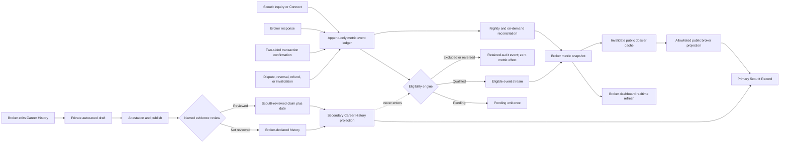

# A-023 — Canonical Broker Dossier and editor

> This file is A-023's single authoritative Active home. `ACTIVE.md` is its
> queue index.

## Outcome and current defect

Build one premium broker master page with two separate statistics templates,
authorized property representations, broker-written description, explainable
Scout Rating, client recommendations, inspectable ScoutIt contributions, and one
compliant Connect path. Editing uses the Property Review model: structured
editor left and exact desktop/mobile public preview right.

Today `/brokers/[broker-slug]` reads Airtable but its
`managedProperties` is always empty and it expects `broker.scoutRating`, which
normalization never supplies. `/profile/[id]` separately renders a 5-point
broker panel while the broker page expects 100 points. Identity, URL, and metric
authority must converge before expansion. The property-scoped roster also
claims its first broker is selected by an algorithm weighting subscription tier,
then calls the full roster “strictly” independently rated, “purely meritocratic,”
and untouched by commercial tier. No published formula or source supports those
claims; remove them in phase 1 rather than polishing contradictory trust copy.

## Locked authority

- ScoutIt owns composition, chapters, typography, motion, SEO, accessibility,
  metrics, trust labels, and Connect routing.
- Brokers edit declared facts only: portrait, biography, firm, markets,
  categories, languages, areas, working style, availability, and optional intro
  media.
- Brokers may edit Career History; they never edit credentials, represented properties,
  ScoutIt events/statistics, recommendations, contributions, or badges.
- Tier may change capacity/media limits; it never buys trust or rating.
- Every public card says whether it is broker-declared, client-submitted,
  ScoutIt-computed, staff-verified, or source-linked.

## Public dossier

1. **Identity + rating:** specific PRC evidence, markets, specialties,
   availability, and Scout Rating. Insufficient data says **Building a ScoutIt
   record**, never zero stars.
2. **Mathematical signals:** two isolated templates; the ScoutIt Record is primary.
   - **ScoutIt Record — primary:** automatically computed only from auditable
     activity completed through ScoutIt: qualifying two-sided transaction
     handshakes, in-platform response rate and median response time, qualifying
     recommendation count, transaction recency, and sample size. Brokers can
     inspect this record but cannot edit it.
   - **Career History — secondary:** broker-editable, self-reported experience
     such as years practicing, historical transaction count or volume, markets,
     property types, and date range. Every value requires a unit, coverage
     period, source/evidence note, and broker attestation. It remains labelled
     **Broker-declared** unless a named verification workflow has passed.
   - Never add, average, normalize, or visually merge Career History into the
     ScoutIt Record or Scout Rating. Low-sample, stale, disputed, or missing
     ScoutIt values stay absent rather than being backfilled from history.
3. **Current Representations:** compact cards derived only from active, visible,
   contactable, owner-accepted `property_broker_representations`. They link to
   canonical property pages without repeating chapters. Brokers cannot add,
   retain, or reorder them; ended/locked/suspended/withdrawn/off-market rows
   obey their visibility rules.
4. **About the Advisor:** structured broker-provided narrative with length,
   markup, unsupported-claim, and contact-leak controls.
5. **Client Recommendations:** ScoutIt cards with consented attribution,
   relationship type, date, moderation, and **Verified ScoutIt connection** only
   for a qualifying deal. External items remain unverified. Screenshots are
   private evidence, never public presentation.
6. **ScoutIt Contributions:** inspectable links to published Q&A, approved
   corrections, briefings, and credited Intel. Contributions stay separate from
   rating.
7. **Connect:** availability, service area, representations, Connect
   consequence, and compliant inquiry/viewing route; no public contact bypass.

## Rating and recommendations

- V1 Scout Rating follows the locked rule: only a completed two-sided
  buyer–broker transaction handshake qualifies; representation acceptance does
  not. Supporting statistics are named signals, not hidden weights.
- Remove conflicting 5-point and 100-point displays. Any future composite needs
  a published formula, anti-gaming review, minimum sample, reversal/dispute and
  backfill rules, plus separate owner approval.
- The ScoutIt Record always appears before Career History. Search/ranking,
  Scout Rating, ScoutIt badges, and platform incentives may use only eligible
  ScoutIt-owned events—not self-reported history, subscription tier, or paid
  visibility. Real platform use earns a richer sourced record, not an artificial
  score boost.
- Exclude circular, duplicate, self-dealing, test, collusive, rapidly reversed,
  or otherwise ineligible activity before aggregation.
- Reversed, disputed, duplicate, test, refunded, or invalidated events do not
  contribute; aggregates reproduce from audited source events.
- Recommendation authors choose full name, initials, role-only, or anonymous.
  Brokers cannot edit/fabricate them. Consent, source, proof, moderation,
  withdrawal, and redaction are recorded. No immature star average ships.

## Editor and data architecture

- Structured left editor, exact live preview, autosaved private draft, explicit
  publish state, dirty-state protection, completeness, and provenance.
- No custom font, palette, HTML, script, freeform layout, badge, property,
  ScoutIt metric, or recommendation controls; Career History uses fixed fields, units, periods, evidence, and attestation.
- Airtable `BROKERS_CMS` stays the public identity/content source; Supabase
  stays Auth plus private/operational authority. Broker drafts save to Supabase;
  an audited bridge publishes only allowed narrative fields to Airtable. Staff
  PRC/example/trust fields are excluded from broker payloads.
- Supabase owns representations, handshakes, recommendations, contributions,
  consent, disputes, ScoutIt aggregates, and versioned Career History claims. Public rendering consumes one allowlisted
  server projection, never private deal/message data.
- Link Auth UUID to BrokerID explicitly, never by mutable email/name.
- `/brokers/[BrokerID]` is canonical; broker-shaped `/profile/[id]` output
  redirects or becomes a non-indexed owner preview.

## Broker metrics update pipeline

The ScoutIt Record is event-driven and near-real-time; it is not recalculated
from every private deal whenever a profile opens. Career History follows a
separate broker-authored publishing path.

### Logical data boundaries

Names below are logical contracts; A-023's prepared migration will select final
table, view, function, and index names.

- **Metric event ledger:** append-only event ID, broker Auth UUID/BrokerID,
  event type, source entity, occurred-at time, eligibility state/reason,
  policy version, idempotency key, and reversal link. No client writes it
  directly.
- **Metric snapshot:** one reproducible aggregate per broker and metric window,
  including numerator, denominator, sample size, freshness, calculation time,
  and policy version. It contains no message body, client identity, negotiation,
  address, or private deal value.
- **Career History claims:** broker-owned draft and published revisions with
  fixed metric key, value, unit/currency, coverage dates, source/evidence note,
  attestation, verification state, reviewer, and withdrawal history.
- **Public projection:** allowlisted ScoutIt Record plus Career History under
  distinct keys. It cannot expose the event ledger or join private deal data.

### Update cadence and user experience

| Signal | Becomes visible | Delivery |
|---|---|---|
| Broker response time | After a valid response event | Dashboard within seconds; public cache invalidated |
| Response rate | After response or expiry closes an eligible inquiry | Snapshot refresh; show denominator/sample |
| Transaction | Pending after both sides submit; official only after eligibility passes | Pending privately, then qualified snapshot |
| Dispute/reversal | As soon as the authoritative state changes | Remove effect, retain audit/reversal link |
| Recommendation count | After qualifying connection, consent, and moderation | Snapshot refresh |
| Career History edit | Draft immediately; public only after attested publish | Separate secondary projection |
| Evidence review | After named staff workflow completes | Claim label and review date update |
| Reconciliation | Nightly, after policy changes, and operator-triggered | Rebuild snapshots and alert on drift |

The broker's authenticated editor may subscribe to their snapshot and draft
changes through Supabase Realtime. Anonymous public profiles use cache
invalidation/revalidation rather than permanent sockets; target freshness is
seconds to roughly one minute, while correctness and qualification take
priority over cosmetic instant updates.

### Calculation and integrity rules

- Completed ScoutIt transactions count distinct qualified two-sided transaction
  handshakes, never representations or unilateral clicks.
- Response rate is eligible inquiries answered within the published window
  divided by eligible inquiries whose window has closed.
- Median response time uses only eligible responses and always shows its window
  and sample; low samples are suppressed.
- Every write is idempotent. A retried webhook, route, or job cannot double-count.
- Qualification and snapshot refresh happen server-side, preferably in the same
  transaction or through a durable outbox; the browser never awards trust.
- Policy changes create a new calculation version and trigger reconciliation;
  they do not silently rewrite history without an audit trail.
- Failed aggregation leaves the last known snapshot marked stale and alerts
  operations. It never substitutes Career History or a fabricated zero.
- Public UI distinguishes **Pending**, **Building a ScoutIt record**,
  **Qualified**, **Stale**, **Disputed**, and **Unavailable** where applicable.

## Delivery phases

1. Converge live fields, canonical ID/URL, rating contract, and public-safe
   field tests.
2. Build the projection and dossier with loading, empty, stale, degraded, and
   error states.
3. Build ownership-checked draft/edit/publish, sanitization, autosave, preview,
   audit events, and honest empty composition.
4. Add versioned recommendation/contribution consent, moderation, withdrawal,
   dispute, private evidence, and artifact linkage.
5. Add reproducible metrics with sample/freshness thresholds and reversal
   handling.
6. Complete metadata, mobile/Lite/reduced-motion, migration/rollback, and owner
   visual review.

### Phase 1 checkpoint — 2026-08-26

The migration-free trust-convergence slice is implemented. The canonical
dossier and property roster no longer render the unsupported Airtable/legacy
five-point or 100-point composites, default missing performance to zero, rank
brokers by those values, or claim that subscription tier participates in a
trust recommendation. The roster preserves representation-authority order and
labels the absent metric projection **Building a ScoutIt record**. The public
roster API no longer emits the legacy rating/closure fields, private broker
profiles are excluded from its identity projection, and broker-shaped legacy
profiles are non-indexed.

A-023 remains Active: projection, generated representations, editor/publish,
recommendations, contributions, metrics, migrations, responsive verification,
and owner visual review are still open.

### Phase 2 checkpoint — 2026-08-26

The allowlisted public projection now exists and the dossier consumes it.

**The identity link was already there and nobody had used it.** Airtable's
`BrokerID` carries the broker's Supabase Auth UUID — verified against live data
(`e7f3634b-65d7-4adc-90ea-0544b61d988d` resolves to Marco Villanueva in both
systems). No migration was needed to generate representations. `BrokerID` is
therefore the link, resolved by UUID shape and never by name or email; when the
field is blank `fetchBrokers` falls back to an Airtable `rec…` id, which is not
an Auth identity and is treated as unlinked.

**Two defects closed:**

1. `managedProperties` was hardcoded `[]` in `src/lib/airtable.js`, so the
   dossier printed "No eligible public property representations are attached to
   this dossier." without ever consulting the representation authority. That is
   an assertion of absence produced by never asking (Rule 3, Rule 14). The
   section now reads `property_broker_representations` through the existing
   `isActiveRosterBroker`/`sortRoster` helpers and distinguishes four states:
   `LISTED`, `NONE_ELIGIBLE` (the only one that claims emptiness),
   `NOT_LINKED`, and `LOOKUP_FAILED`. State names are deliberately distinct from
   `REPRESENTATION_STATES`; an overlapping `UNAVAILABLE` in both would read as
   one condition and is two.
2. Phase 1 took the legacy composites off the screen but `/api/cms` kept
   shipping them. Live production was still publishing `rating: 92.5`,
   `closures: 34` and a commercial `subscriptionLabel` on every page load —
   public data regardless of whether a component read it (Rule 5). The broker
   payload is now allowlisted at source; the dead `TIER_LABEL_TO_NUM` map went
   with the field it fed.

A representation becomes a public card only when three independent sources
agree: the representation row is eligible, the Supabase property is live, and
the property is in the public Airtable catalog.

**Career History was deliberately not built.** Its claims table is
migration-gated under W-003, and the safest isolation from the ScoutIt Record
while no source exists is to publish no history at all. A contract test pins
that absence so a later phase cannot quietly merge the two templates.

**The loading state is NOT delivered and is carried forward.** A route-level
`loading.js` was built and then removed: with any `loading.js` present on
`/brokers/[broker-slug]`, the Suspense fallback stranded — `aria-busy="true"`
stayed visible with nine skeletons while the resolved dossier sat in a hidden
streaming div and was never swapped in. Removing the file restored correct
rendering; a minimal fallback with no `Header`/`Footer` reproduced the same
stall, so it is the boundary itself and not the fallback's content. SSR output
was correct in both cases. Root cause is unresolved and could not be tested
against a production server because `.next` was contended by another dev
process. Recorded in the Inbox as
`2026-08-26_ROUTE_LOADING_FALLBACK_STRANDS.md`.

Verified: 25/25 focused A-023 contracts (16 projection + 9 authority-read),
with the fail-closed guard mutation-tested — breaking the catch turns 3 tests
red, restoring it returns 9/9. Full gate green (3/3 surface locks, lint,
typography, 1,655/1,655 unit tests, 574 E2E cases discovered) and the production
build compiles. Browser-verified against a running server at 375px and 1280px:
zero horizontal overflow, one H1, grid collapses to a single column on mobile,
the notice variant renders its muted-gold rule, and no legacy composite appears
in the rendered text or the `/api/cms` payload.

Boundary: `NOT_LINKED` and `LOOKUP_FAILED` are unit-tested and style-verified
but not reachable with current data — all three live brokers carry a valid Auth
UUID, and `property_broker_representations` holds zero rows, so the live dossier
correctly renders `NONE_ELIGIBLE`. No deploy, migration, or live-data write.

## Boundary and exit test

Code and prepared migrations are Active; live application remains behind
[[WAITING#W-003|W-003]]. Never fabricate/backfill scores, reviews, response
times, closures, contributions, or properties; never expose client identity,
messages, deal value, negotiations, private saves, or withdrawn properties.

Done means one canonical URL serves every entry path; brokers publish only
allowed narrative; preview matches public output; representations match eligible
authority; V1 rating matches qualifying handshakes including reversal,
duplicate, and test cases; every recommendation has consent/source; every
contribution opens its artifact; low-sample/error states make no false claim;
authorization, privacy, XSS/contact-leak, accessibility, metadata, responsive,
full verification, build, and 3/3 surface locks pass. Live schema/data/deploy
changes remain separately owner-approved.

The two templates must remain mathematically isolated in storage, projection,
UI, ranking, and rating tests. Historical edits must never alter the primary
ScoutIt Record.

